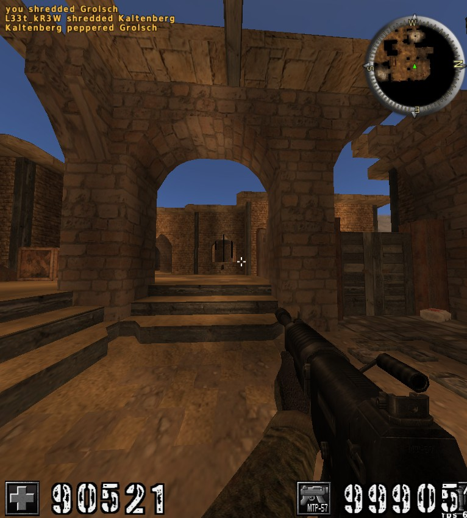

# gamecheat
Proof-of-the concept linux game cheating engine (draft version)

## What can it do?
  - Scan the entire address space of target process (game)
  - Find specific value (amount of gold)
  - Change it

..Sometimes this super simple strategy gives amazing results!
This program was tested on several random games.

## Crackable games examples:
  - bastet (one really awkward tetris clone) 
    https://www.cyberciti.biz/open-source/bastet-tetrisr-clone-game-for-linux-unix-console/
   It is possible to change the score. Result is visible at the end.
   
  - wesnoth (some weird strategy) https://www.wesnoth.org/
   It is possible to change the amount of gold.
   
  - 0ad (nice strategy) https://play0ad.com/. 
  Amounts of resourses are stored in integer and double variables simoultaniously. 
  Changing the double guys leads to profit.

  - Nice shooter called Assaultcube (https://assault.cubers.net/). 
  We can change the amount of frags, hp and armor. They are stored in integer variables =)

## Detailed explaination:

1) We manually parse the contents of /proc/PID/maps to get memory regions
2) Scan all regions (except shared libraries and other nonrelevant places) for specific value (yet only integer)
3) Probably we will get multiple entries
4) Change value inside the game and scan again suspicious addresses (using process_vw_readv)
5) Repeat 4 until single location is determined
6) Write desired value into this location (using process_vw_writev)

## Future plans

- Normal cli interface
- More natural way of handling different data types (unsigned integers, float, double, unicode strings, ASCII...)
- Watchpoints (increase the value if it is lower than.. etc)
- Another search strategy 
  For example we know the pattern of change of target variable and make several memory dumps and then locate bytes which
  change at the same moments as target variable.
- Optimize the performance (search only even addresses/ find which addresses are reserved but not used)
